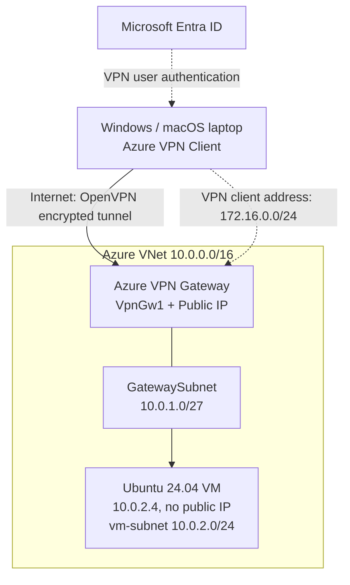

# Azure Point-to-Site (P2S) VPN — Complete Hands-on Lab

Connect a **Windows or macOS laptop** to an **Azure Ubuntu VM with no public IP** through an Azure VPN Gateway using **OpenVPN + Microsoft Entra ID**.

> **Cost warning:** VPN Gateway is billed while provisioned. Delete the lab resource group when finished. Gateway provisioning can take 30–60 minutes or longer.

## 1. Architecture



| Resource | Value |
|---|---|
| Resource group | `rg-p2s-lab` |
| Region | `centralindia` |
| VNet | `vnet-p2s` — `10.0.0.0/16` |
| VM subnet | `vm-subnet` — `10.0.2.0/24` |
| Gateway subnet | `GatewaySubnet` — `10.0.1.0/27` |
| VPN client address pool | `172.16.0.0/24` |
| VPN Gateway | `vpngw-p2s`, `VpnGw1`, route-based |
| VM | `vm-p2s`, Ubuntu 24.04, `10.0.2.4` |
| Protocol / authentication | OpenVPN (SSL) / Microsoft Entra ID |

**Prerequisites:** Azure subscription with appropriate permissions, Azure CLI (or Azure Cloud Shell Bash), a Microsoft Entra tenant, Azure VPN Client on your laptop, and SSH. Ensure the address ranges do not overlap with your local network or other VPNs. `VpnGw1` availability and VM sizes vary by subscription and region.

## 2. Sign in and set variables

Run these commands in **Bash** (Azure Cloud Shell or local macOS/Linux terminal). Replace the subscription ID.

```bash
az login
az account list -o table
az account set --subscription "YOUR_SUBSCRIPTION_ID"
az account show -o table

RG=rg-p2s-lab
LOCATION=centralindia
VNET=vnet-p2s
VM_SUBNET=vm-subnet
GATEWAY=vpngw-p2s
VM=vm-p2s
NSG=nsg-p2s-vm
PIP=pip-p2s-gateway
VNET_CIDR=10.0.0.0/16
VM_CIDR=10.0.2.0/24
GATEWAY_CIDR=10.0.1.0/27
VPN_POOL=172.16.0.0/24
VM_IP=10.0.2.4
```

If you open a **new shell**, rerun the variable block.

## 3. Create resource group and network

```bash
az group create --name "$RG" --location "$LOCATION"

az network vnet create \
  --resource-group "$RG" \
  --name "$VNET" \
  --location "$LOCATION" \
  --address-prefixes "$VNET_CIDR" \
  --subnet-name "$VM_SUBNET" \
  --subnet-prefixes "$VM_CIDR"

az network vnet subnet create \
  --resource-group "$RG" \
  --vnet-name "$VNET" \
  --name GatewaySubnet \
  --address-prefixes "$GATEWAY_CIDR"

az network vnet subnet list \
  --resource-group "$RG" --vnet-name "$VNET" \
  --query '[].{Name:name,Prefix:addressPrefix}' -o table
```

The gateway subnet **must** be named `GatewaySubnet`. Do not associate the VM NSG with the gateway subnet.

## 4. Create NSG and inbound rules

Allow SSH and HTTP **only from VPN client addresses**:

```bash
az network nsg create \
  --resource-group "$RG" --name "$NSG" --location "$LOCATION"

az network nsg rule create \
  --resource-group "$RG" --nsg-name "$NSG" \
  --name Allow-VPN-SSH --priority 100 \
  --direction Inbound --access Allow --protocol Tcp \
  --source-address-prefixes "$VPN_POOL" \
  --destination-address-prefixes "$VM_IP" \
  --destination-port-ranges 22

az network nsg rule create \
  --resource-group "$RG" --nsg-name "$NSG" \
  --name Allow-VPN-HTTP --priority 110 \
  --direction Inbound --access Allow --protocol Tcp \
  --source-address-prefixes "$VPN_POOL" \
  --destination-address-prefixes "$VM_IP" \
  --destination-port-ranges 80
```

## 5. Generate SSH key and create private Ubuntu VM

If using **Cloud Shell**, the generated private key stays in Cloud Shell; securely transfer it to your laptop for the final SSH test. Never upload the private key to a public repository.

```bash
ssh-keygen -t ed25519 -f ~/.ssh/p2s_lab_key

az vm create \
  --resource-group "$RG" \
  --name "$VM" \
  --location "$LOCATION" \
  --image Ubuntu2404 \
  --size Standard_B2s \
  --admin-username azureuser \
  --ssh-key-values ~/.ssh/p2s_lab_key.pub \
  --vnet-name "$VNET" \
  --subnet "$VM_SUBNET" \
  --nsg "$NSG" \
  --public-ip-address "" \
  --private-ip-address "$VM_IP"
```

**Important:** For Azure CLI, `--public-ip-address ""` means *no public IP*. If your shell or CLI treats the quoted value unexpectedly, create a NIC explicitly with no public IP using the alternative below and then create the VM with `--nics`:

```bash
# Alternative to the az vm create command above; do not run both paths.
# az network nic create -g "$RG" -n nic-p2s-vm --vnet-name "$VNET" \
#   --subnet "$VM_SUBNET" --network-security-group "$NSG" \
#   --private-ip-address "$VM_IP"
# az vm create -g "$RG" -n "$VM" --location "$LOCATION" \
#   --image Ubuntu2404 --size Standard_B2s --admin-username azureuser \
#   --ssh-key-values ~/.ssh/p2s_lab_key.pub --nics nic-p2s-vm
```

Verify the VM and its IP:

```bash
az vm show -g "$RG" -n "$VM" -d \
  --query '{Name:name,Power:powerState,PrivateIP:privateIps,PublicIP:publicIps}' -o table
```

Expected: private IP `10.0.2.4`; **no public IP**.

## 6. Create VPN Gateway public IP and gateway

The gateway has a public IP for the VPN connection. **The VM does not.**

```bash
az network public-ip create \
  --resource-group "$RG" --name "$PIP" \
  --location "$LOCATION" --sku Standard \
  --allocation-method Static

az network vnet-gateway create \
  --resource-group "$RG" \
  --name "$GATEWAY" \
  --location "$LOCATION" \
  --vnet "$VNET" \
  --public-ip-addresses "$PIP" \
  --gateway-type Vpn \
  --vpn-type RouteBased \
  --sku VpnGw1
```

Provisioning often takes 30–60 minutes or more. Check status:

```bash
az network vnet-gateway show -g "$RG" -n "$GATEWAY" \
  --query '{Name:name,State:provisioningState,SKU:sku.name}' -o table
```

Proceed after `Succeeded`.

## 7. Configure P2S OpenVPN + Microsoft Entra ID

Get your tenant ID and the Microsoft-registered Azure VPN Client Audience:

```bash
TENANT_ID=$(az account show --query tenantId -o tsv)
AAD_TENANT="https://login.microsoftonline.com/$TENANT_ID"
AAD_ISSUER="https://sts.windows.net/$TENANT_ID/"
AAD_AUDIENCE="c632b3df-fb67-4d84-bdcf-b95ad541b5c8"

printf 'Tenant: %s\nAudience: %s\nIssuer: %s\n' \
  "$AAD_TENANT" "$AAD_AUDIENCE" "$AAD_ISSUER"
```

Configure the gateway P2S client address pool and authentication:

```bash
az network vnet-gateway update \
  --resource-group "$RG" \
  --name "$GATEWAY" \
  --address-prefixes "$VPN_POOL" \
  --client-protocol OpenVPN \
  --vpn-auth-type AAD \
  --aad-tenant "$AAD_TENANT" \
  --aad-audience "$AAD_AUDIENCE" \
  --aad-issuer "$AAD_ISSUER"
```

If your installed Azure CLI version does not recognize one of these arguments, update Azure CLI (`az upgrade`) and/or configure **Virtual network gateway → Point-to-site configuration** in the Azure portal using exactly the values above. Check the portal for any required tenant consent prompts. The Audience shown is for the Microsoft-registered Azure VPN Client; other app-registration configurations use different values.

Verify:

```bash
az network vnet-gateway show -g "$RG" -n "$GATEWAY" \
  --query 'vpnClientConfiguration' -o json
```

## 8. Download and import the VPN client profile

**Portal steps (recommended for Entra ID profiles):**

1. Azure portal → **Virtual network gateways** → `vpngw-p2s`.
2. Open **Point-to-site configuration** and confirm the address pool, OpenVPN and Microsoft Entra ID settings.
3. Select **Download VPN client**.
4. Extract the ZIP file and find the Azure VPN Client profile in the `AzureVPN` folder (typically `azurevpnconfig_aad.xml`).
5. Install **Azure VPN Client** on Windows or macOS.
6. Open Azure VPN Client → **Import** → select the XML profile → **Save** → **Connect**.
7. Sign in with an account from your configured Entra tenant. Confirm **Connected**.

> A generic VPN client package is not interchangeable with the Entra ID Azure VPN Client profile. Prefer the portal's downloadable XML for this authentication method.

## 9. Validate from your laptop

Run the following **on the laptop with Azure VPN Client connected**, not in Azure Cloud Shell.

### macOS

```bash
ifconfig
netstat -rn
route -n get 10.0.2.4
chmod 600 ~/.ssh/p2s_lab_key
ssh -i ~/.ssh/p2s_lab_key azureuser@10.0.2.4
```

### Windows PowerShell

```powershell
Get-NetIPConfiguration
Get-NetRoute -AddressFamily IPv4
Test-NetConnection 10.0.2.4 -Port 22
ssh -i "$HOME\.ssh\p2s_lab_key" azureuser@10.0.2.4
```

Use the actual private key location on your laptop. Successful SSH demonstrates private connectivity through the VPN.

## 10. Install Nginx and test HTTP

Once SSH is connected to Ubuntu:

```bash
sudo apt update
sudo apt install nginx -y
sudo systemctl enable --now nginx
printf '<h1>Azure P2S VPN Lab Successful</h1>\n' | sudo tee /var/www/html/index.html
curl http://localhost
hostname -I
```

On your **connected laptop**, open **http://10.0.2.4** in a browser or run:

```bash
curl http://10.0.2.4
```

Expected: `Azure P2S VPN Lab Successful`.

## 11. Test isolation

1. Disconnect Azure VPN Client.
2. Run `ssh -o ConnectTimeout=10 -i ~/.ssh/p2s_lab_key azureuser@10.0.2.4` from your laptop.
3. Without another route to the Azure VNet, the connection should fail.
4. Reconnect Azure VPN Client and repeat the SSH and HTTP tests; both should work.

## 12. Troubleshooting

| Symptom | Checks |
|---|---|
| Gateway stuck deploying | Wait; check deployment operations, quota, SKU and region |
| Azure VPN Client fails to sign in | Entra tenant, Audience, Issuer, consent and imported profile |
| VPN connects but SSH times out | Route to VNet, correct private IP, NSG source `172.16.0.0/24`, SSH daemon |
| HTTP fails but SSH works | `sudo systemctl status nginx`; NSG port 80; VM firewall |
| Laptop routes incorrectly | Overlapping home/office/VPN address ranges |
| Ping fails | ICMP can be blocked; test TCP 22 or 80 instead |

Helpful diagnostics:

```bash
az network nsg rule list -g "$RG" --nsg-name "$NSG" -o table
az network vnet-gateway show -g "$RG" -n "$GATEWAY" -o json
az vm show -g "$RG" -n "$VM" -d -o table
```

## 13. Student checklist

- [ ] Resource group, VNet and two subnets created
- [ ] VM created with private IP and **no public IP**
- [ ] NSG allows VPN client pool on ports 22 and 80
- [ ] VPN Gateway deployed successfully
- [ ] P2S OpenVPN + Entra ID configured
- [ ] Azure VPN Client connected on laptop
- [ ] SSH works to `10.0.2.4`
- [ ] Nginx website opens through VPN
- [ ] SSH fails after disconnecting VPN (assuming no alternate route)
- [ ] Lab resources deleted

## 14. Cleanup

**Destructive:** The following deletes *all* resources in `rg-p2s-lab`. Verify that the resource group contains only this lab before running it.

```bash
az group delete --name "$RG" --yes --no-wait
```

## Official documentation

- [Microsoft Learn — About Point-to-Site VPN](https://learn.microsoft.com/en-us/azure/vpn-gateway/point-to-site-about)
- [Microsoft Learn — Configure P2S with Microsoft Entra ID](https://learn.microsoft.com/en-us/azure/vpn-gateway/openvpn-azure-ad-tenant)
- [Microsoft Learn — Azure VPN Client for macOS](https://learn.microsoft.com/en-us/azure/vpn-gateway/point-to-site-vpn-client-cert-mac)
- [Azure CLI — Virtual network gateway](https://learn.microsoft.com/en-us/cli/azure/network/vnet-gateway)
